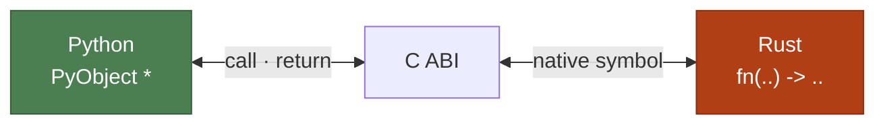

+++
title = "Le constat"
classes = ["no_title"]
+++

<style>
/* Titre collé en haut : la marge négative le sort en partie du `space-evenly`
   de l'article, ce qui rapproche le titre du bord et rend le reste au corps.
   Trois précautions :
   — dupliqué slide par slide, parce que le thème rend le corps dans un shadow
     root que le CSS de `_head.html` ne traverse pas ;
   — les `:not()` parce que l'export statique (et le PDF) met tous ces `<style>`
     dans un seul document : la règle fuirait sur les mises en page qui n'ont
     aucune marge à récupérer (titre centré, `.step` en `flex: 1`, terminal
     plein cadre, code dense) et le titre sortirait par le haut ;
   — -0.5em et pas plus : au-delà, « Le constat » et « Deux façons d'appeler »
     débordent par le haut. Mesuré sur /run, de 1280×800 à 3840×2160. */
section:not(.center):not(.spread-steps):not(.fourneaux):not(.dense-code) > article > h1 {
	margin-block: -0.5em;
}
</style>

# Le constat

- 🐍 Python sait appeler du **C** — `ctypes`, `cffi`, C-API
- 🦀 Rust sait produire du **C** — trois annotations suffisent

<!-- pause -->

```rust
#[repr(C)]                    // layout C, pas celui de Rust
pub struct Point { x: f64, y: f64 }

#[unsafe(no_mangle)]          // symbole `norm`, pas `_ZN4norm…`
pub extern "C" fn norm(p: *const Point) -> f64 { /* … */ }
```

<!-- pause -->



<!-- pause -->

→ Techniquement, ça marche **depuis toujours**. Alors, c'est quoi le problème ?

<!-- notes -->

- Ce qui a fait le succès de Python, c'est justement ça : rendre accessibles des
  API bas-niveau performantes. numpy, scipy, pandas, PyTorch — le langage est
  lent, l'écosystème ne l'est pas, parce que le cœur est en C/C++/Fortran/CUDA.
  Rust ne change pas le modèle, il change le confort d'écriture de ce cœur
- L'ABI C est le plus petit dénominateur commun de l'industrie depuis 50 ans
- ABI ≠ API : c'est la convention *binaire*, au niveau des registres — sur System V AMD64, 6 args entiers dans rdi/rsi/rdx/rcx/r8/r9, les flottants dans xmm0..7, le reste sur la pile, retour dans rax. Windows x64 est différent (rcx, rdx, r8, r9 + shadow space)
- Les 3 frictions quand on quitte C : name mangling (`extern "C"`), layout des structs (`repr(C)`), chaînes (`\0` final vs `(ptr, len)`)
- Ces 3 frictions, c'est exactement ce que PyO3 va nous éviter d'écrire à la main
- Ne pas s'attarder : 45 s, c'est du contexte, pas le sujet
